# Subset Loci for GT-Seq Panel Development

## Panel Goal
The panel will be used to identify population of origin for samples from throughout the GOA and Bering Sea. Initial projects in the works include 1) identifying spawning population of origin for summer caught Pacific cod from various regions including the Northern Bering Sea, GOA, and AI. 

## Sample distribution
We have samples that spawn the Eastern GOA through the AI and up into the Bering Sea and Russia that were all in spawning condition. In addition, we have samples that were not in spawning condition that were tagged in the summer in the Northern Bering Sea (i.e., yellow and dark orange points Vesteraalen-tagged 9 and AK-Knight-tagged 20) and two samples tagged in the summer in the AI (i.e., orange point Aleutian Tagged - 2). These tagged samples were not included in the development of the panel and will not be a part of the data shown below.  
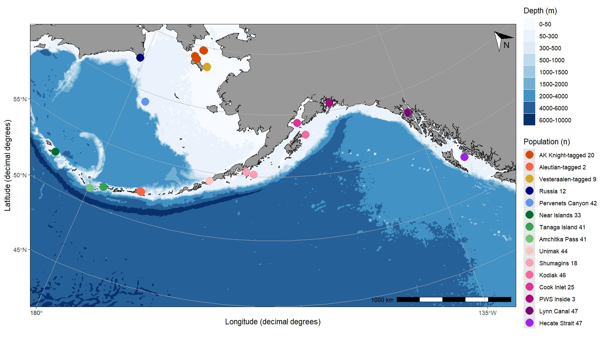  

 

## Atlantic cod reference genome

### Genetic Structure
Using low-coverage whole-genome sequencing data, we evaluated the population genetic structure of Pacific cod across our sampled range. We first evaluated structure using principal component analysis (PCA) to identify genetic clusters in our data.   

#### All markers 
We first plot the genomewide PCA to look at genomewide differentiation:    
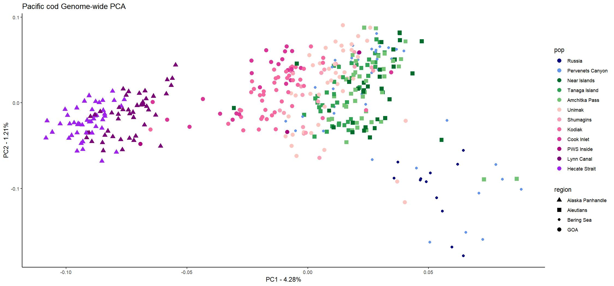  

**Conclusion**: This analysis shows that we have three to four main clusters based on genomewide data: eGOA, wGOA/AI, Russia/Some Bering Sea. Some conclusions we can draw from these results: 1) we see evidence for IBD in the GOA samples through the AI, 2) Russia is a distinct population that overlaps with some of the Pervenents samples, 3) eGOA is genetically distinct from wGOA, and 4) Pervenents seems to be an admixed population. Next step is to look at genomic outliers.  

 

### *FST* analysis
#### Genomewide
We next analyzed pairwise *FST* values from across the whole genome and compared across populations.  

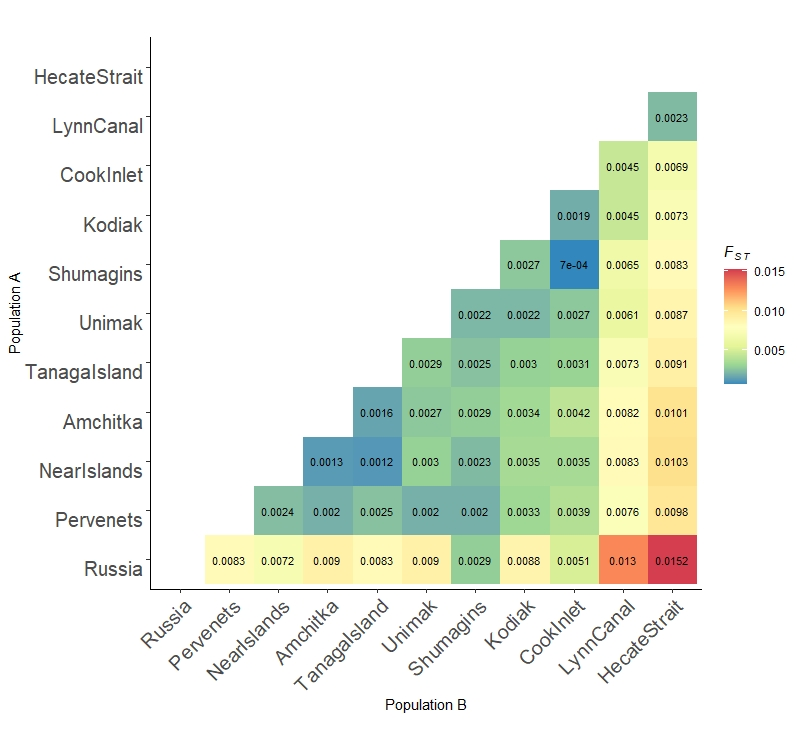  

**Conclusion**: This analysis shows that 1) eGOA (Hecate Strait & Lynn Canal) and Russian samples are the most distinct from other populations, 2) Schumagins is genetically similar to most populations except eGOA (even Russia), and 3) overall FST is between 0.0007 (Schumigans and Cook Inlet) and 0.0152 (Hecate Strait and Russia).  

 

#### Per locus *FST*
We next analyzed pairwise *FST* values per site in the genome to identify regions in the genome that are highly differentiated between population pairs. This will help us identify which loci we want to use in panel development.   

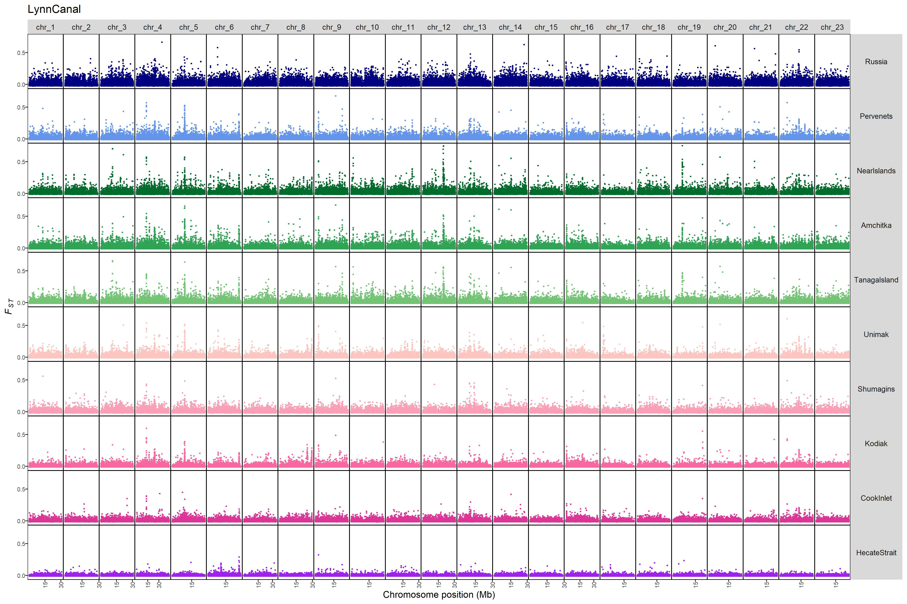  

[View per chromosome FST outliers for Lynn Canal comparison here.](./20220422_LynnCanal_FSTperChromPerSite.md)  

From these analyses we see 1) that there are large islands of divergence that correspond to differentiation between AI populations and most other populations on chromosome XXX, 2) XXX, 3) XXX. 

[View genomic island analyses with targeted PCAs here.](./20220422_IslandAnalyses.md)  

 

### Subset loci for GT-seq Panel
Now we need to use the data above to decide on a set of between 150-300 loci for GT-seq panel development. To identify the structure we hope to identify with this panel, we first subset the data using the top 0.1% of loci which resulted in 8576 loci. Using these loci, we reran and plotted the results of a PCA. 

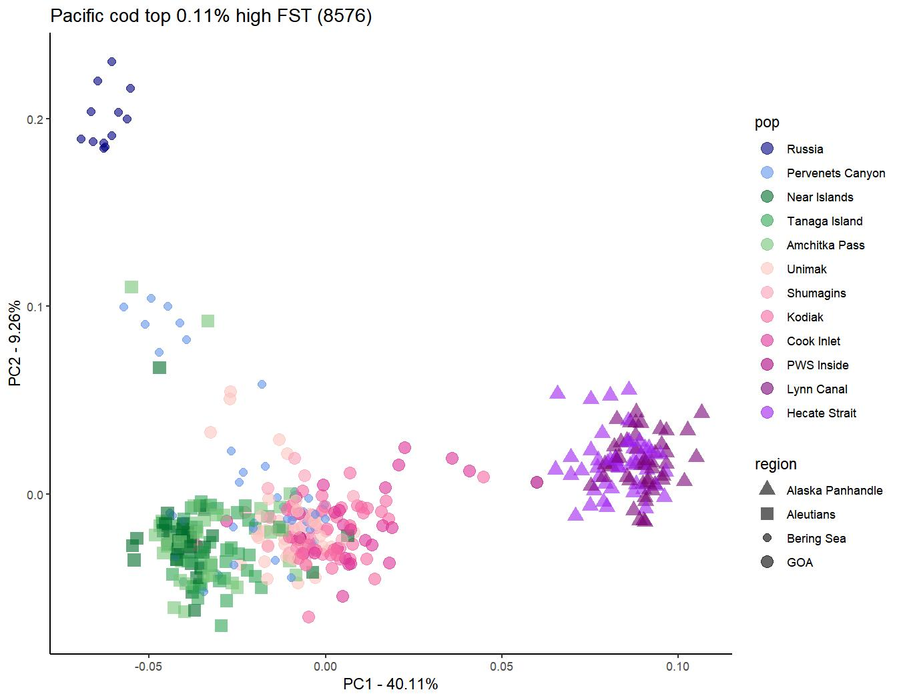  

**Conclusion**: This is the structure we want to capture with the goal of assigning individuals to eGOA, wGOA, AI, Russia & unique Pervenents genotype. However, we want to get this structure using only 150-300 loci not around 8000. So we need to cleverly subset the data to get at this structure.  

 

#### HMM

Our first thought was to use Hidden Markov Models to target genomic regions that contain islands and choose a subset of loci from each island identified in HMM based on the method by [Marques et al. 2016](https://github.com/marqueda/HMM-detection-of-genomic-islands/blob/master/HMM_log10FST%2B1_3norm.R). However, when we ran HMM on the full dataset (all pairwise comparisons) many comparisons (about 1/3) failed to converge in the Baum-Welch algorithim. We are still exploring whether this can be resolved in any way and why it happens.   

 

#### top X percent *FST* loci that results in < 300 loci
We first wanted to see what resolution we would get by looking just at the top *FST* markers that results in less than 300 markers (what we are targetting for our panel).  

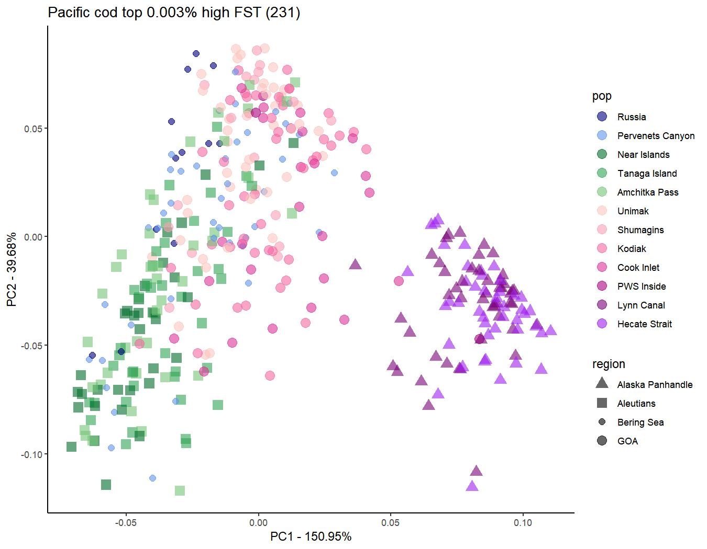  

**Conclusion**: This analysis shows strong separation of eGOA from the rest of the samples, however there is limited separation of all other populations.

 

#### top X percent *FST* loci per chromosome that results in around 300 loci

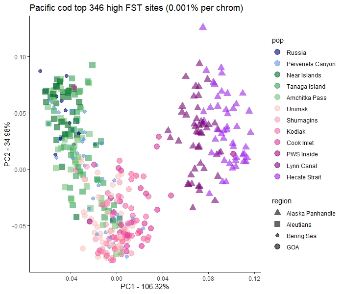  

**Conclusion**: This shows us that we do not get the same resolution especially for Russia and Pervenets genotype. Although we do get fairly strong separation between eGOA, wGOA, and AI. This is because we are not capturing the structure between all pairwise comparisons and we are getting overrepresentation of certain islands that have high *FST* values relative to everything else. 

 

#### Top 10 per chromosome per comparison with additional filtering (methods 1-3)
Because of the aformentioned biases/overrepresentations of certain regions by just taking the top *FST* outliers either genomwide or by chromosome, we needed a creative solution to get the structure present in our dataset. 

The filtering went as follows:
1) identify the top 10 *FST* outlier loci per chromosome per pairwise comparison: 10 x 23 x 55 = 12,620 loci. 
2) subset based on unique loci: 7,872 loci
3) filter out low *FST* values because some pairwise comparisons have very low overall *FST* so we filtered out all loci with *FST* < 0.2: 3,148 loci
4) finally with this dataset I took each chromosome and split it into 6 even windows and pulled out the 2 loci with the highest *FST* values: 6 x 2 x 23 = 276 loci (**METHOD 1**)  

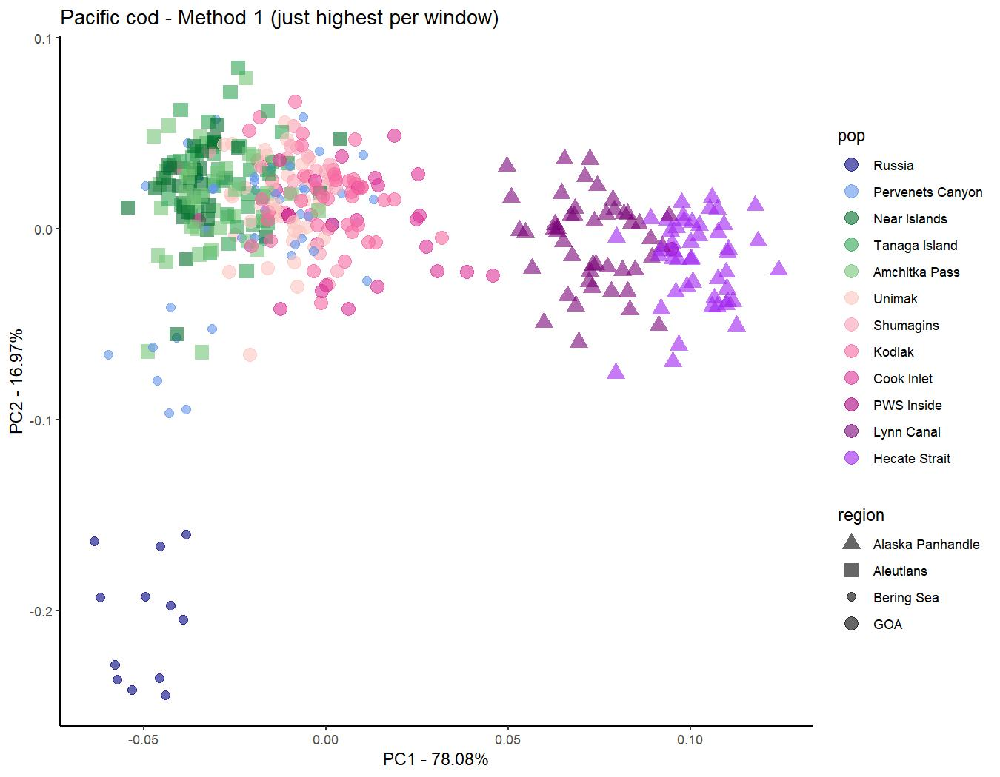

**Conclusion**: Results from this analysis get us close to what we are looking for. This separates eGOA, wGOA, Russia, and Pervenets unique genotype well. It is lacking a bit in its ability to separate out AI samples from wGOA however. 

 

**METHOD 2**

As an addition to method 1, an additional qualifier per chromosome is added: only one locus can come from a given comparison for each chromosome. This keeps a single pairwise comparison from over contributing to the final set of loci per chromosome.  

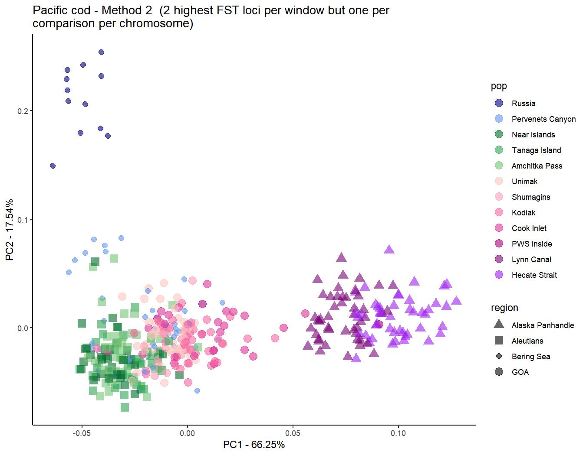  

**Conclusion**: This method gives us the best resolution so far for splitting our five targeted regions: eGOA, wGOA, Russia, Pervenents unique genotype, and AI.   

 

**METHOD 3**

To test whether method 2 is too conservative, the qualifier was changed to check that only one locus can come from a given comparison within each window. This then allows multiple loci to come from a given comparison per chromosome in case there are multiple islands on a chromosome that are strongest in one pairwise comparison.  

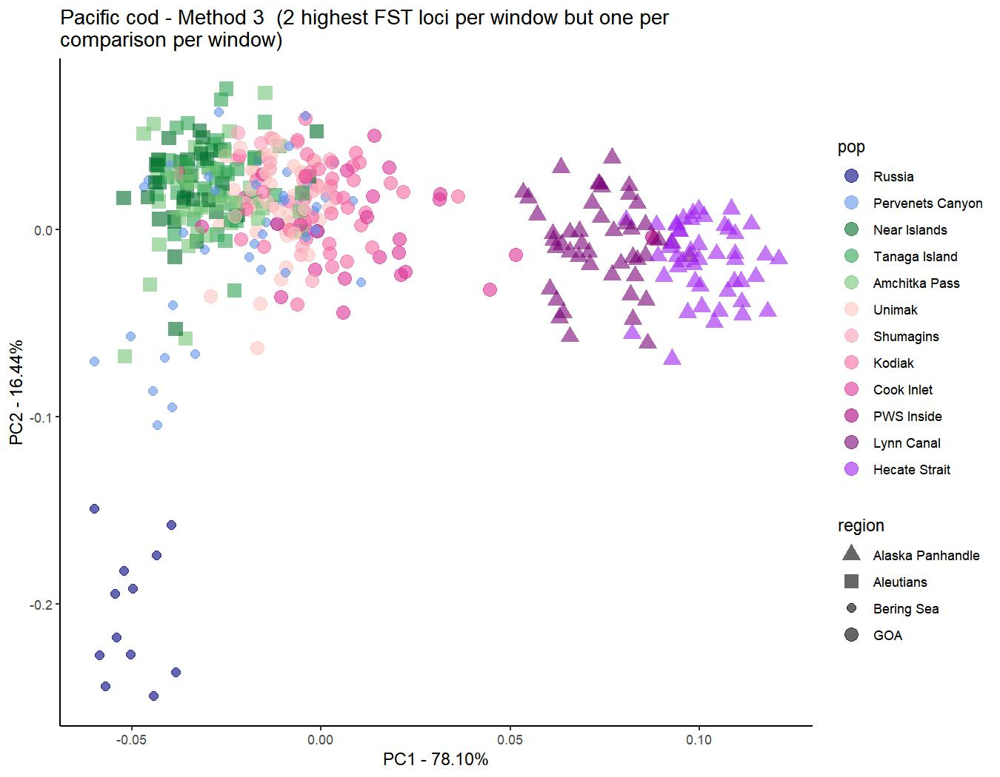  

**Conclusion**: This one actually performed slightly worse than method 2 in terms of separating out AI from wGOA and the unique Pervenents genotype from AI. Method 2 has the best resolution compared to our goal plot.  

 
 

### Add some markers at island on chr 12 and ZP3

We wanted to add a few extra markers from chromosome 12 which differentiates AI Pacific cod from all other populations. In addition, we wanted to add a few markers from ZP3 a known gene of interest from previous work by Ingrid (see Spies et al. 2021).

Adding too many markers from the island on 12 caused clusters to become some what muddled (see first figure below). So I needed to find a balance of markers that helped separate out AI from wGOA, but did not change Russia/NBS Shelf or wGOA clusters. 

#### 18 loci from chr 12 island and 5 ZP3

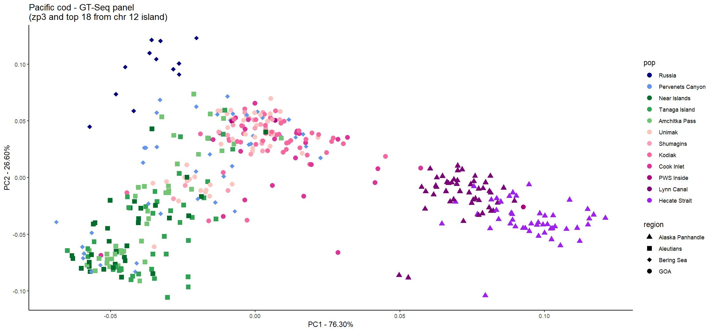

**Conclusion**: some Russian samples now cluster closely with wGOA and a a large cluster of samples from AI, Pervenets, and Unimak split off in between AI and wGOA. 

 

#### 8 top FST loci from unique pairwise comparisons on chr 12 and 5 ZP3  

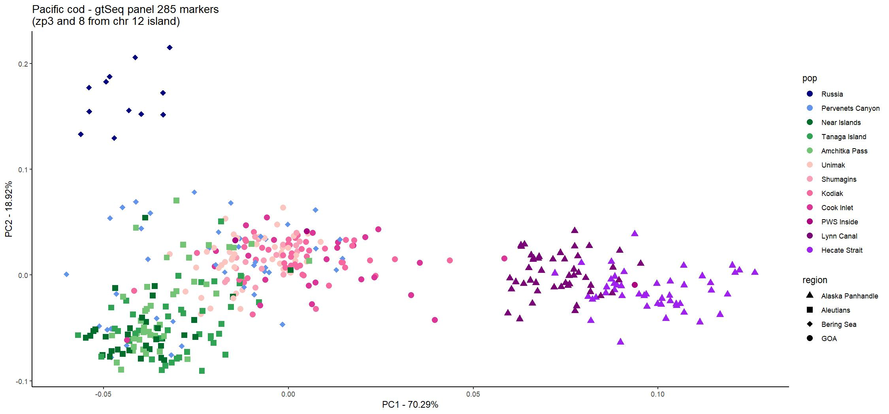

**Conclusion**: keeps Russian samples separate from wGOA and still gets nice separation of wGOA and AI. **This is the final GT-Seq Panel!**

 

#### Distribution of GT-seq SNPs 

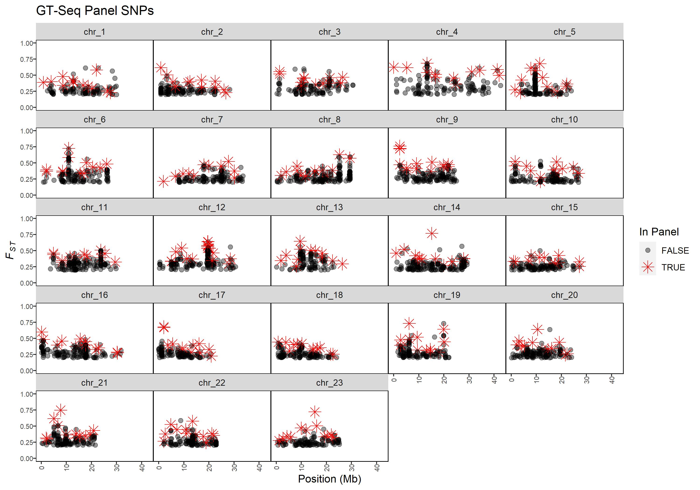
 

#### Zoom in on Chr 12  
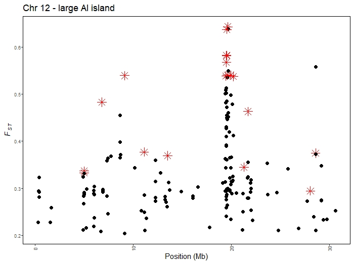

 

#### Zoom in on Chr 9  
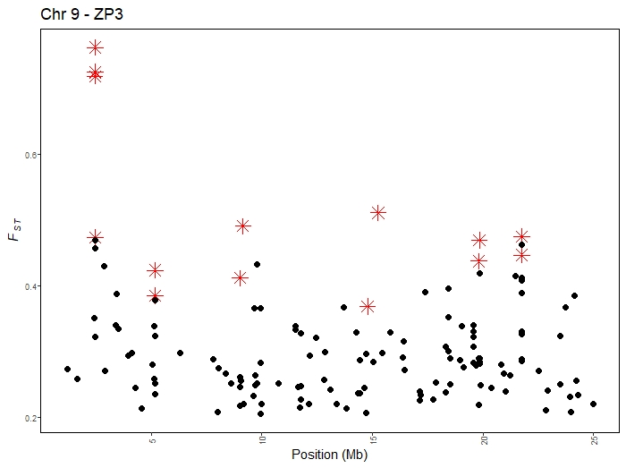
