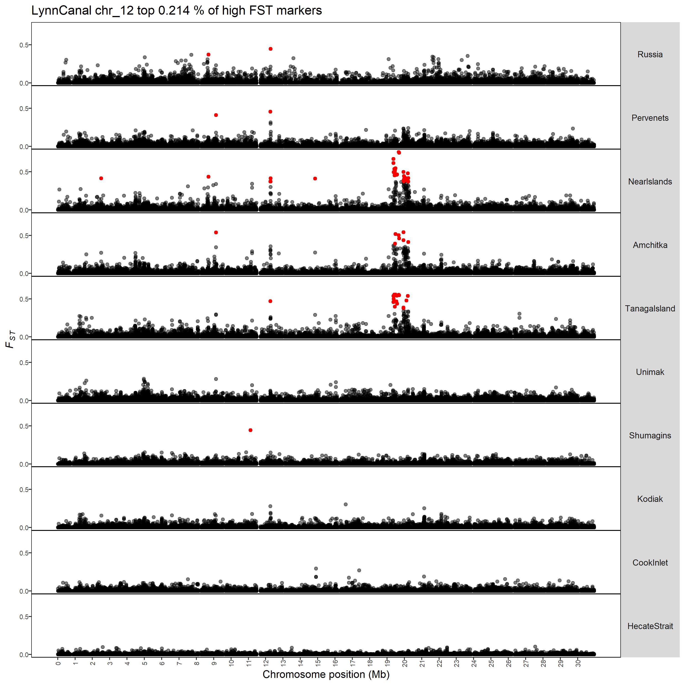
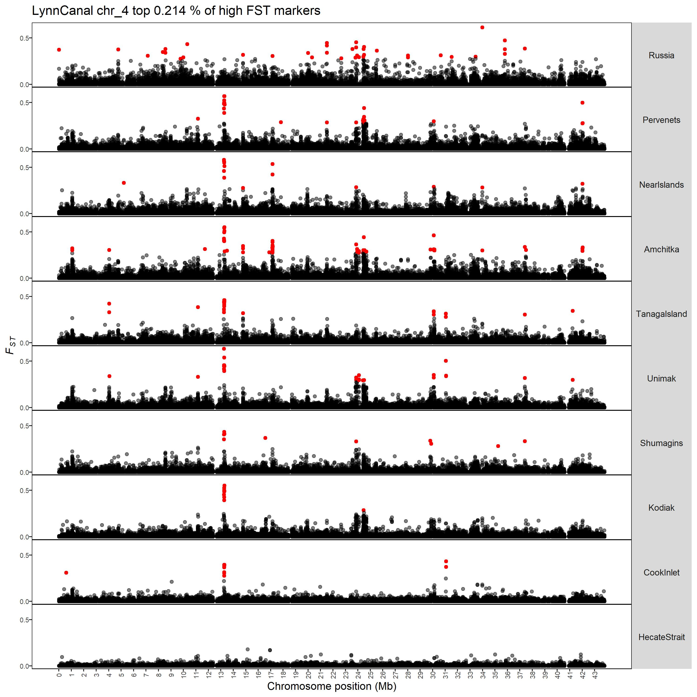
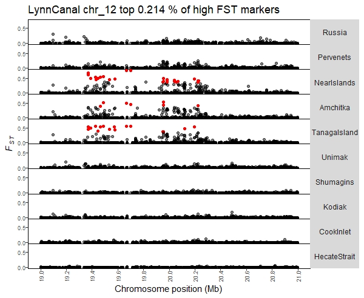

## Goal
Use a sliding window to identify potentially interesting regions of the genome in an automated unbiased way. These regions will then be used for targeted PCA. 

## Outline of Current Methodology

### Part 1: get high *F<sub>ST</sub>* markers

Initial steps to get high *F<sub>ST</sub>* markers:   
1) concatenate all pairwise *F<sub>ST</sub>* comparisons into one data frame  
2) subset that data frame by chromosome and identify the top 0.02% of loci from each chromosome  
3) combine all by chromosome loci into one data frame   

This results in some repeat loci, but will allow us to know where islands are shared between different pairwise comparisons. If we subset based on top 0.02% per chromosome for the cod genome that is 0.214% of all UNIQUE loci (1815825 loci) in the genome and is 0.01% of loci across all pairwise comparisons (55*1815825 loci).  

**POTENTIAL CHANGE**: I think this is a spot to discuss changing. I could also subset by first identifying the highest *F<sub>ST</sub>* value for each locus then subset by a top percentage on those 1815825 loci. However, I don't think this is the right approach because an island (in my opinion.. could be the wrong opinion) should be identified on a by pairwise comparison basis not across all pairwise comparisons. Another potential change is the threshold. I had it first at 0.01%, but then loci even in the big island chromosome 12 were not being called as high *F<sub>ST</sub>* markers.    

<br>

Here is an example of the loci that are called using this method for the 10 pairwise comparisons with Lynn Canal:  
  
**Conclusion**: In this example, red indicates a locus that is in the top percent from the first step of the analysis. Here we see that there are loci in the large island on both the first half and second half of the island. However, there aren't many loci identified in the small island that is further upstream. This may be fine, it depends on how conservative or liberal we want to make the *F<sub>ST</sub>* cutoff discussed above and which islands we want this method to identify. 

<br>

Here is another example chromsome (chr 4):  


<br>

## Part 2: Sliding window

Use a sliding window to identify interesting regions. Parameters that need to be determined:   
1) set the window size (currently 100 kb)  
2) set the sliding distance (currently 50 kb)  
3) set the number of high *F<sub>ST</sub>* loci required in the window to be called an island region (currently 3)  

Steps to code:  
1) first create an outer loop to subset the *F<sub>ST</sub>* data frame for each chromosome individually and for each chromosome identify all windows based on chromosome size. This results in the final window of each chromosome varying in size depending on how the window increments divides into the chromosome size (**I DON'T THINK THIS IS A PROBLEM BUT LET ME KNOW YOUR THOUGHTS**).   
2) then step through each pairwise comparison for that chromosome and identify where islands might exist based on our window stepping and number of loci threshold  
3) append the information of the island location to a growing data frame that will include all potential islands and which pairwise comparison they come from  

With these parameters, we identify the first side of the big island on chromosome 12 in both the LynnCanal-NearIslands comparison and the LynnCanal-TanagaIsland, but the second half of the island is only identified in the LynnCanal-NearIslands comparison. I think this is okay because the island is identified just not in each comparison where we know it exists. This will then add that window to a our list for a downstream targeted pca analysis which is the goal of this code. The output below is for this analysis on chromosome 12 (NC_044059.1) for those two comparisons. The first column is the unique window identifier (chr_windowStart), second column is chromsome, third column is window start, fourth column is window end, and final column is the comparison it was flagged in.    

```{}
 island_windows_df
```

```{}
      [,1]                   [,2]          [,3]       [,4]       [,5]                            
 [1,] "NC_044059.1_19300001" "NC_044059.1" "19300001" "19400001" "LynnCanal-TanagaIsland.fst.txt"
 [2,] "NC_044059.1_19350001" "NC_044059.1" "19350001" "19450001" "LynnCanal-TanagaIsland.fst.txt"
 [3,] "NC_044059.1_19400001" "NC_044059.1" "19400001" "19500001" "LynnCanal-TanagaIsland.fst.txt"
 [4,] "NC_044059.1_19450001" "NC_044059.1" "19450001" "19550001" "LynnCanal-TanagaIsland.fst.txt"
 [5,] "NC_044059.1_19500001" "NC_044059.1" "19500001" "19600001" "LynnCanal-TanagaIsland.fst.txt"
 [6,] "NC_044059.1_12200001" "NC_044059.1" "12200001" "12300001" "NearIslands-LynnCanal.fst.txt" 
 [7,] "NC_044059.1_12250001" "NC_044059.1" "12250001" "12350001" "NearIslands-LynnCanal.fst.txt" 
 [8,] "NC_044059.1_19300001" "NC_044059.1" "19300001" "19400001" "NearIslands-LynnCanal.fst.txt" 
 [9,] "NC_044059.1_19350001" "NC_044059.1" "19350001" "19450001" "NearIslands-LynnCanal.fst.txt" 
[10,] "NC_044059.1_19400001" "NC_044059.1" "19400001" "19500001" "NearIslands-LynnCanal.fst.txt" 
[11,] "NC_044059.1_19450001" "NC_044059.1" "19450001" "19550001" "NearIslands-LynnCanal.fst.txt" 
[12,] "NC_044059.1_19900001" "NC_044059.1" "19900001" "20000001" "NearIslands-LynnCanal.fst.txt" 
[13,] "NC_044059.1_19950001" "NC_044059.1" "19950001" "20050001" "NearIslands-LynnCanal.fst.txt" 
[14,] "NC_044059.1_20000001" "NC_044059.1" "20000001" "20100001" "NearIslands-LynnCanal.fst.txt" 
[15,] "NC_044059.1_20150001" "NC_044059.1" "20150001" "20250001" "NearIslands-LynnCanal.fst.txt" 
[16,] "NC_044059.1_20200001" "NC_044059.1" "20200001" "20300001" "NearIslands-LynnCanal.fst.txt" 

```

Here is the same plot from above just zoomed in on big island on chromosome 12 to see how the islands were called.   




